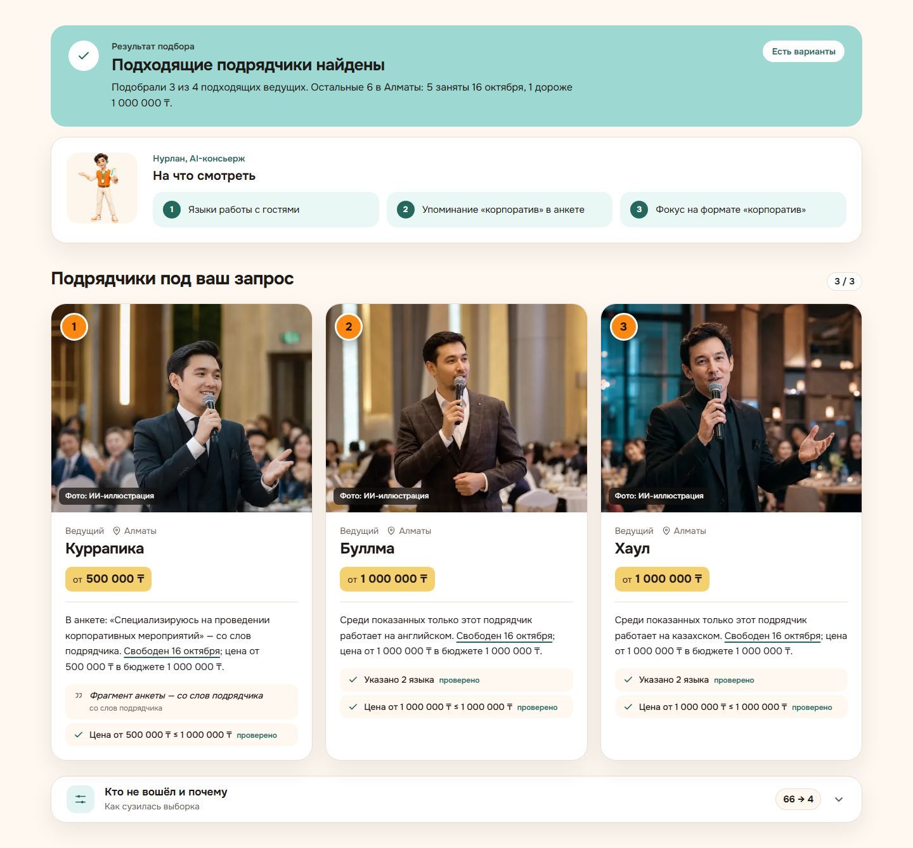
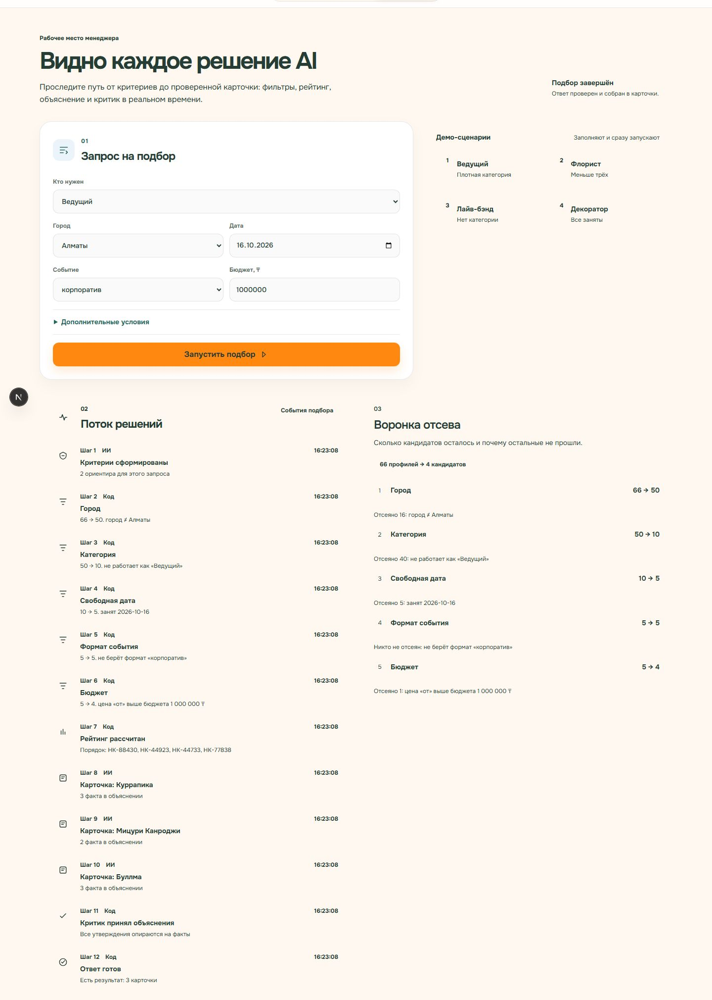

# ToiMatch — подбор event-подрядчиков с доказательствами

> HackAlem AI 2026 · трек 06 «Креативные индустрии» · задача Firebird «Умный подбор подрядчиков» (#79-lite) · команда Code & Design (Ян Пинчук, Никита Костров, Иван Лысов)

## Проблема и для кого
Заказчик мероприятия в Казахстане открывает каталог подрядчиков своего города и тонет в похожих профилях: описания одинаковые («харизма», «топ-10»), непонятно, чему верить и на что смотреть. Менеджер площадки вручную собирает клиенту 3 варианта и объясняет выбор.

**Ценность в цифрах.**
- *Время.* Сейчас менеджер на один запрос открывает 10–50 профилей категории в городе и сверяет по каждому календарь, цену, формат и язык. По нашей оценке это десятки минут. ToiMatch отвечает за 15–250 мс (замер в режиме без ключа) и сразу показывает, почему выбран каждый вариант и кто отсеян.
- *Кому.* Выгоду получают заказчик, который быстрее выбирает, и площадка или агентство, которые встраивают подбор как услугу для клиентов. Каталог получает честную выдачу: недоступных и неподходящих подрядчиков сервис не показывает.

ToiMatch по городу, дате, типу события, категории и бюджету возвращает **до трёх подрядчиков** и для каждого — **объяснение, почему именно он**. Сначала сервис говорит, **на что смотреть** в этом случае (язык ведения, опыт с таким форматом, часы на площадке), затем объясняет каждую карточку по этим пунктам, а каждый факт в объяснении сверяется с данными каталога.

## Что реализовано
- Подбор `POST /api/v1/match`: фильтр по фактам, детерминированное ранжирование, объяснения, три явных исхода: `found`, `no_category_in_city`, `all_filtered_out`.
- Пошаговый стрим пайплайна `GET /api/v1/match/stream` (SSE) для экрана площадки.
- Каталог `GET /api/v1/contractors` с фильтрами и профиль `GET /api/v1/contractors/:id`.
- Кеш объяснений в PostgreSQL: тот же запрос — тот же текст и порядок.
- Чат с режимами поиска и полного пакета мероприятия: перед сборкой пакета считает минимальный бюджет, честно показывает пустые категории, а итоговые имена и причины берёт из результатов инструментов, а не из свободного текста модели.
- Режим без ключа (MOCK): весь сценарий работает без сети и без наших аккаунтов.
- Фронт (Next.js): каталог `/`, подбор `/match`, рабочее место площадки `/manager` (старый адрес `/admin` перенаправляет туда), профиль `/contractor/[id]`, чат-помощник `/chat`; интерфейс на русском, казахском и английском; маскот-помощник Нурлан.

## Как работает — от запроса до результата
1. Заказчик выбирает, кто нужен (категория), город, дату, событие и бюджет; можно указать длительность и язык.
2. **Фильтр (код):** город → категория → свободен в эту дату → берёт этот формат → в бюджете → язык → часы. На каждом шаге считается, сколько кандидатов выбыло и почему (воронка).
3. **Ранжирование (код):** детерминированный порядок по измеримым критериям запроса, при равенстве — по `id`.
4. **Объяснения:** сервер собирает проверяемые варианты причин из полей каталога, отличий от других карточек и точных фрагментов анкет. OpenAI выбирает подходящий вариант, но не пишет свободный текст о подрядчике; без ключа выбор детерминированный.
5. **Проверка фактов (код):** причина сверяется с выбранной карточкой до показа и кеширования. Цена с подстановкой и цитаты из описания явно помечены; неподтверждённое объяснение заменяется безопасным вариантом.
6. **Ответ:** исход, до трёх карточек, воронка и человеческая фраза «почему столько».

## Технологии, модели и API
- Frontend: Next.js 16 (App Router), React 19, TypeScript, Tailwind CSS 4, шрифт Onest.
- Backend: NestJS 11, Prisma 6, PostgreSQL 16, Docker Compose.
- LLM: OpenAI `gpt-4o-mini` (переменная `MODEL_MAIN`) выбирает вариант объяснения и участвует в проверке; без ключа — детерминированный клиент (`back/src/matching/llm/mock-llm.client.ts`). Итоговый текст всегда строит сервер из проверенных данных.
- Изображения: фото подрядчиков и маскот сгенерированы OpenAI `gpt-image-2`; анимация маскота — fal.ai (Kling v3); логотип — fal.ai (Recraft V4.1, SVG).
- Общий контракт типов фронта и бэка: [`shared/contract.ts`](shared/contract.ts).

## Архитектура
```
Браузер (Next.js: /, /match, /manager, /contractor/[id], /chat)
   │  POST /api/v1/match          GET /api/v1/match/stream (SSE)      GET /api/v1/contractors
   ▼
NestJS (back/src/matching)
   ├─ FilterService     — фильтр и воронка (детерминированно)
   ├─ RankingService    — порядок, tie-break по id
   ├─ ExplainerService  — проверяемые варианты объяснений, критик, кеш
   └─ LlmClient         — OpenAI или MockLlmClient (без ключа)
   ▼
PostgreSQL (Prisma): contractors · enrichments · explanation_cache
```

## Установка и запуск
Нужен только Docker (с Docker Compose v2). Ключи не нужны.

```bash
git clone https://github.com/BAITC-Hacks/hack-cf5b3e57-code-design.git
cd hack-cf5b3e57-code-design
docker compose up --build
```

Одна команда поднимает PostgreSQL, применяет миграции, загружает сид (66 подрядчиков), запускает API и фронт. Первая сборка занимает несколько минут.

- Сайт: http://localhost:3000 (подбор — http://localhost:3000/match)
- API: http://localhost:3001/api/v1/health → `{"ok":true,"mock":true}`

Остановить и очистить базу: `docker compose down -v`.

**Docker по умолчанию работает без ключа (`MOCK=1`)**: объяснения строятся из тех же проверенных фактов детерминированно, сеть не нужна. Для живой модели передайте `OPENAI_API_KEY` через окружение и установите `MOCK=0`; ключ не записывайте в репозиторий.

### Запуск с живой моделью (по желанию)
Нужен Node.js 22+. База остаётся в Docker, бэк и фронт запускаются локально:

```bash
docker compose up -d postgres
cd back
cp .env.example .env        # вписать OPENAI_API_KEY и установить MOCK=0
npm install
npx prisma migrate deploy
npx prisma db seed
npm run start:dev           # API на http://localhost:3001
```

Во втором терминале:
```bash
cd front
cp .env.example .env.local
npm install
npm run dev                 # http://localhost:3000
```

## Переменные окружения
| Переменная | Где | Зачем | Обязательна |
|---|---|---|---|
| `DATABASE_URL` | `back/.env` | подключение к PostgreSQL | да, значение из `back/.env.example` |
| `PORT` | `back/.env` | порт API | нет, 3001 |
| `OPENAI_API_KEY` | `back/.env` / окружение Compose | живые объяснения и чат моделью при `MOCK=0` | **нет** — без ключа работает MOCK |
| `MODEL_MAIN` | `back/.env` | модель OpenAI | нет, `gpt-4o-mini` |
| `MOCK` | `back/.env` / compose | `1` — принудительно без модели; `0` с ключом — OpenAI | нет; в Docker по умолчанию `1` |
| `BACKEND_URL` | `front/.env.local` | адрес API для сервера Next.js | нет, `http://localhost:3001` (в Docker — `http://backend:3001`) |
| `NEXT_PUBLIC_API_URL` | `front/.env.local` | адрес API для браузера (стрим на `/manager`) | нет, `http://localhost:3001` |

Настоящих ключей в репозитории нет: `.env` и `.env.local` в `.gitignore`, в репозитории только `*.env.example`.

## Экраны
**Подбор `/match`** — запрос 1: три карточки, у каждой своё объяснение и проверенные факты.



**Рабочее место площадки `/manager`** — тот же запрос: поток решений по шагам и воронка отсева.



## Как проверить (сценарий для жюри)
Все запросы работают без ключа. Кнопки с этими примерами есть на странице `/match`.

| # | Запрос | Ожидаемый результат |
|---|---|---|
| 1 | Ведущий · Алматы · корпоратив · 16.10.2026 · до 1 000 000 ₸ | `found`: 3 карточки из 4 подходящих; воронка 10 → 5 свободны → 5 берут корпоратив → 4 в бюджете |
| 1б | То же на 23.10.2026 | Другая тройка: часть ведущих занята 23.10 |
| 2 | Флорист · Алматы · свадьба · 15.10.2026 · до 300 000 ₸ | `found`, меньше трёх: в Алматы всего 2 флориста |
| 3а | Лайв-бэнд · Астана · свадьба · 14.11.2026 · до 1 500 000 ₸ | `no_category_in_city`: в Астане нет лайв-бэндов |
| 3б | Декоратор · Алматы · той · 14.11.2026 · до 3 000 000 ₸ | `all_filtered_out`: все 3 заняты 14.11 и ни один не оформляет той |

Повторный запуск того же запроса в MOCK-режиме даёт тот же порядок и те же тексты. У каждой показанной карточки причина индивидуальна и содержит проверяемую информацию о дате и цене; фрагмент анкеты помечен «со слов подрядчика», а подставленная цена — «ценовой ориентир». Пустой город/категория и отсеивание после фильтров различаются в `outcome` и тексте ответа.

Экран площадки `/manager` показывает тот же подбор пошагово (воронку в реальном времени) и таблицу: каждый факт объяснения → поле каталога → ✓.

## Данные и интеграции
- Каталог: датасет организаторов — 66 анонимизированных профилей, из них 13 синтетических (`synthetic: true`), календарь занятости 23.09–31.12.2026. Загружается сидом из [`back/prisma/seed-data/contractors.csv`](back/prisma/seed-data/contractors.csv). В карточках помечены синтетические профили и проставленные при подготовке датасета цены и города.
- Внешний API: только OpenAI (если задан ключ). Пример запроса:

```http
POST /api/v1/match
Content-Type: application/json

{"city":"Алматы","date":"2026-10-15","eventType":"свадьба","category":"Флорист","budgetKzt":300000}
```
Ответ содержит `outcome`, `summary`, `criteria`, до трёх `cards` с индивидуальными `reason`, `factsUsed` и флагами достоверности данных, а также `funnel` с причинами отсева на каждом шаге.

## Что взяли готовым
- Библиотеки с открытыми лицензиями: Next.js (MIT), React (MIT), Tailwind CSS (MIT), NestJS (MIT), Prisma (Apache-2.0), class-validator (MIT), Onest (SIL OFL).
- Датасет подрядчиков — от организаторов (Firebird).
- **Фото подрядчиков — сгенерированы ИИ** (OpenAI gpt-image-2), люди вымышленные; на сайте каждое фото помечено «Фото: ИИ-иллюстрация».
- Маскот Нурлан — сгенерирован ИИ (gpt-image-2), анимация — fal.ai (Kling v3); логотип — fal.ai (Recraft V4.1).
- ИИ-инструменты разработки: Claude Code и OpenAI Codex. Весь код решения написан 23.09.2026 с 13:00 — это видно по истории коммитов.

## Ограничения
- Без ключа объяснения выбираются детерминированно из проверенных вариантов; с ключом OpenAI помогает выбрать вариант, при сбое — откат на безопасный выбор.
- Интерфейс полностью на русском, казахском и английском. Объяснения полностью готовы на русском. На казахском и английском в итоговых фразах пока остаются русские названия категорий и городов и даты в формате ГГГГ-ММ-ДД.
- Docker по умолчанию работает без модели; для живой модели передайте ключ через окружение и установите `MOCK=0`.
- Нет бронирования, оплаты, авторизации и уведомлений — это вне задачи.
- Каталог маленький (66 профилей), поэтому в редких категориях честно показываем меньше трёх.

## Рабочая версия
Развёрнутой версии нет: жюри запускает проект локально одной командой `docker compose up --build` (см. «Установка и запуск»).
